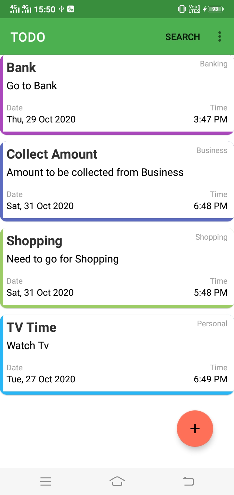

# TODO LIST APP

## ABOUT:
An APP to keep record of all the activities to be performed in day-to-day basis. It helps in making us remember any important task which we might forget later, so we need to store the activities in the app and the app will make us remember when time comes.

## APP IMAGES:

        

## Add Project to Desktop:
1) Open Android Studio App.
2) Follow the steps: File > New > Project from Version Control..
3) In the Box that appears:

    i) Select Version Control as Git from the drop down menu.
    
    ii) In the Url box, paste this url: https://github.com/souvikcode/TodoApp.git .
    
    iii) In the directory, browse the directory where you want.
    
    iv) Select Clone.
    

## How to use the app:
  New tasks can be added using the bottom '+' sign. Added activity can be removed from main screen using right swipe or left swipe of that particular task.
  
## Motivation to build:
   I wanted to develop an offline mode of saving important tasks, as it was always not possible to connect to internet and retrieve saved task, as a result of which I came up with an idea to develop this app, which helps in saving and retrieving saved tasks. 
   
## Contribution:
   Contribution by making pull request are all always welcome. 
